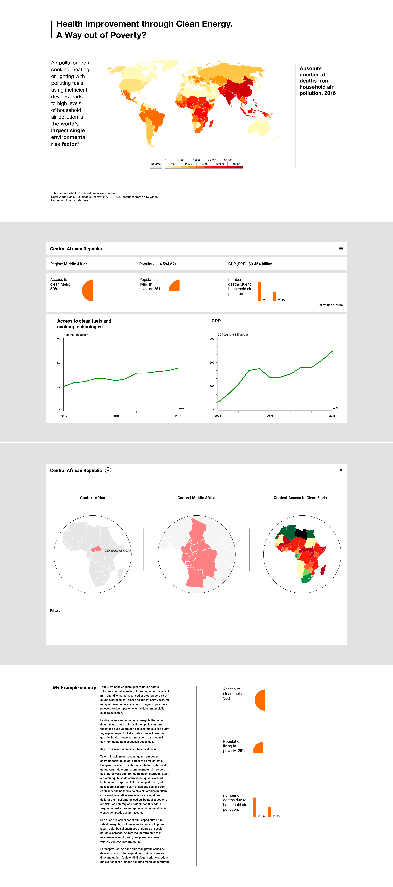

Felix Buchholz
MS Data Visualization @ Parsons NYC, Fall 2018, Major Studio 1, Daniel Sauter

# Assignment 3 – Dynamics, Interactivity and Narrative

## Assignment description

> This exercise builds on the Quantitative assignment, adding interaction and UI principles to the mix. Conceptually, it explores juxtaposition/comparison as a method of assessment.
>
> ### Objective
>
> - Based on the coding principles explored in the quantitative assignment, focus now on your chosen SDG.
> - Identify 2 datasets to juxtapose and formulate a research question that articulates a comparative analysis in the following format:
>
>     ```
>     I’m visualizing ___________________ (Research Question)
>     because I want to show __________________ (Significance)
>     in order to ____________________ (Goal)
>     ```
>
> - Add the navigation and UI elements to enable a comparison and enrich the user experience.
>
> ### Methods
>
> 1. Sketch and iterate on paper first.
> 2. Imagine a viewer and keep in mind what that viewer is expected to know.
> 3. What will the viewer learn.
> 4. What can you do to engage the viewer visually.
> There are no constraints regards to implementation and coding libraries. Use this exercise to experiment.
>
> Submit (to this assignment on Canvas)
>
> - a research question
> - at least two data sources (Chicago style reference)
> - a direct link to your index.html file on github.com
> - (optional) a PDF with design thinking on Canvas


## My approach

### Area of interest

TODO, Rephrase into two to three paragraphs:

- Poverty
- Relation to energy
- Relation to health
- Access to clean fuels, indoor air pollution – _has also a personal dimension to me_

### Resources

A good amount of research I’m interested in is already done here:

- **With important data references:**
  - [Our world in data, Indoor Air Pollution](https://ourworldindata.org/indoor-air-pollution)

  - I think I want to try a smiliar approach, but of course with a focus on Africa. Trying to find exceptional examples in Africa that could be a good or bad example.
- _Bjorn Lomborg_ seems to have a special interest in the subject, but generally is in favor of fossil fuels as transitionary tool for the poor, also sees GDP growth as means to poverty reduction, not the other way round as I want to suggest:
  - [Fight Poverty to Reduce Pollution](http://bobcat.library.nyu.edu/primo-explore/fulldisplay?docid=TN_proquest1551784739&context=PC&vid=NS2-NUI&search_scope=default_scope&tab=default_tab&lang=en_US)
    - _[...]indoor air pollution has declined, because the increasing number of people coming out of poverty can now afford to cook using modern energy. [...]this appears hypocritical, because the West gets only 0.8 percent of its energy from solar and wind. [...]these technologies receive annual subsidies worth $60 billion, and China can definitely find better uses for that sort of money._
  - [The Poor Need Fossil Fuels](https://www.nytimes.com/2013/12/04/opinion/the-poor-need-cheap-fossil-fuels.html)
- **There is also well-reasoned and documented disagreement with that argument:**
  - [Why You Don’t Need Fossil Fuel to Fight Poverty. (Clean Energy Does it Better.)](https://www.nationalgeographic.com/environment/great-energy-challenge/2014/why-you-dont-need-fossil-fuel-to-fight-poverty-clean-energy-does-it-better/)
- And Maybe economic interest for pushing fossil fuels:
  - [Rich countries pushing 'dirty energy' in Africa, report claims](https://www.theguardian.com/global-development/2018/jul/23/rich-countries-pushing-dirty-energy-africa-report-claims)
- Mali might be a bad example:
  - [The day the lights went out: the terrible toll of Malawi's power cuts](https://www.theguardian.com/global-development/2017/dec/13/malawi-power-cuts-national-blackouts-poor-hungry)
- National Geographic has a good overview on the health issues:
  - [Cookstove Smoke is “Largest Environmental Threat,” Global Health Study Finds](https://www.nationalgeographic.com/environment/great-energy-challenge/2012/cookstove-smoke-is-largest-environmental-threat-global-health-study-finds/?user.testname=photogallery:3)


### My research question

**I’m visualizing** the relationship between access to clean fuels and cooking technologies and indicators linked to poverty in African countries with the highest rate of increase in access to clean fuels, **because** I want to show how important the access to clean fuel is to reduce the vulnerability of the poor **in order to** raise awareness to this issue and maybe even suggest a new perspective on the relation between the achievement of the SDGs and GDP growth.

**Details:**

It is commonly argued that GDP growth helps elevate the poorest and most vulnerable parts of the population out of the most precarious conditions, what if for a change we could propose the suggestion that improving these most severe conditions is actually an opportunity to encourage GDP growth. Another aspect of this research can be to also show how women and children are more heavily affected by indoor air pollution.


### My sketches





### My approach to narration and interactivity

References or inspiration:

I really like explorative data visualizations, especially when they allow to set scales and contexts. I found a good approach to scales in this visualization:

[https://vizhub.healthdata.org/mortality/45q15-results](https://vizhub.healthdata.org/mortality/45q15-results)

### My datasets

#### List:

- For SE4All, GDP and poverty indicators: [World Bank Open Data](https://data.worldbank.org/)
- For health indicators and death rates: [The Institute for Health Metrics and Evaluation (IHME)](http://www.healthdata.org/)
  - See also [WHO](http://apps.who.int/gho/data/node.main.BODHOUSEHOLDAIRDTHS?lang=en)

#### Details:

##### Household Air Pollution
**Found on:**
[https://ourworldindata.org/indoor-air-pollution](https://ourworldindata.org/indoor-air-pollution)

**Reference:**
Data published by	Global Burden of Disease Collaborative Network. Global Burden of Disease Study 2016 (GBD 2016) Results. Seattle, United States: Institute for Health Metrics and Evaluation (IHME), 2017.

**Link:**
[http://ghdx.healthdata.org/gbd-results-tool](http://ghdx.healthdata.org/gbd-results-tool)

**Explanation:**
The Global Burden of Disease (GBD) database reports the absolute number of deaths across mortality cause and risk factors for any given year.
It is important to understand the distinction between risk factors and causes of deaths. Causes of deaths are defined by the OECD as: "the underlying cause of death refers to the disease or injury that initiated the train of morbid events leading directly to death or the circumstances of the accident or violence that produced the injury." Causes of deaths therefore include particular events such as road accidents, natural disasters, drowning, HIV/AIDS, and non-communicable diseases such as diabetes, and various cancers.
Risk factors are particular behaviors or lifestyle factors which affect the probability of incidence of particular diseases and causes of death. For example, tobacco smoking is a risk factor which increases the probability of lung cancer. In this case, it is not tobacco smoking in itself which is the cause of death, but the increased incidence of lung cancer.
In order to identify and highlight the specific behaviours, lifestyle factors - and thereby the potential intervention points for prevention of mortality - this data presents a mix of causes of death and risk factors. Many of the variables are straightforward causes of death - such as road accidents, drowning, fire, malaria, terrorism fatalities. However, for non-communicable diseases such as stroke, cancer, diabetes, which can form a complex combination of preceding behaviour and lifestyle factors we have instead presented the IHME's attributed figures by risk factors, including high blood pressure, obesity, high blood sugar & tobacco smoking. Identification of these factors is more conducive to highlighting the specific behaviours or preventative factors which can be addressed in order to improve health outcomes and reduce mortality rates.
Causes and risk factors are further clarified as follows:
'Outdoor air pollution' refers to outdoor/ambient exposure to particulate matter (PM) and ozone.
'Drug use' refers to the use of cannabis, opioids, or amphetamines, or use of injecting drugs [does not include tobacco or alcohol]. This is distinguished from 'drug disorders' which refers to direct death as a result of drug dependence and drug abuse.
'Alcohol disorders' refers to death as a result of alcohol dependence and alcohol abuse; this is distinguishable from 'alcohol use', which is premature death as a result of general alcohol consumption which is linked to increased risk of certain diseases.
'Road accidents' includes deaths from all road vehicles, including drivers, passengers, pedestrians and cyclists.

'Nutritional deficiencies' are defined as protein-energy malnutrition, iodine, vitamin-A, and iron deficiency.

##### Air Pollution Death Rates (Indoor Solid Fuels) per 100,000-

**The Institute for Health Metrics and Evaluation (IHME)**
[http://www.healthdata.org/](http://www.healthdata.org/)

Variable time span	1990-2015

**Reference:**
Data published by	Institute for Health Metrics and Evaluation (IHME), 2016
Data publisher's source	Global Burden of Disease Study 2015. Global Burden of Disease Study 2015 (GBD 2015)

**Link:**
[http://vizhub.healthdata.org/gbd-compare/](http://vizhub.healthdata.org/gbd-compare/)


####
